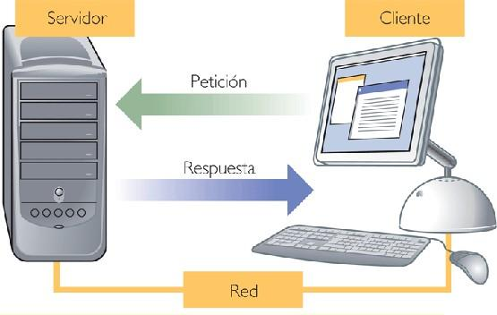

## 1. DESARROLLO WEB
La web fue inicialmente concebida y creada por Tim Berners-Lee, un especialista del laboratorio europeo de partículas (CERN) en 1989. En sus mismas palabras, había una "necesidad de una herramienta colaborativa que soportara el conocimiento científico" en un contexto internacional. Él y su compañero Robert Cailliau crearon un prototipo web, lo mostraron a la comunidad para sus pruebas y comentarios.
Dicho prototipo estaba basado en el concepto de hipertexto ( Texto que cuando pulsamos en él nos conduce a otro texto, objeto, sonido, video, sección o documento relacionado ). Como resultado se crearon unos protocolos ( cuando pulsamos en él nos conduce a otro texto, objeto, sonido, vídeo, sección o documento relacionado ) y especificaciones que han
sido adoptados universalmente e incorporados a Internet, gracias a aportaciones posteriores como el desarrollo por la NCSA de la popular interfaz MOSAIC.
Todos los prototipos y desarrollos posteriores crecieron bajo la guía del consorcio W3C, que es una organización con base en el MIT de Massachusetts, que se responsabiliza de desarrollar y mantener los estándares web.

## 2. ESTRUCTURA CLIENTE SERVIDOR
Hoy en día los sitios web siguen un modelo basado en la programación cliente-servidor con tres elementos comunes:

1. El lado del servidor [server-side] Incluye el hardware y software del servidor Web así como diferentes elementos de programación y tecnologías incrustadas. Las tecnologías pueden abarcar un rango amplio desde programas CGI escritos en PERL hasta aplicaciones multihilo ( También denominado multiproceso hace referencia a la posibilidad de ejecutar diferentes trozos de código de una misma aplicación de forma simultánea ) basadas en Java, incluyendo tecnologías de servidor de bases de datos que soporten múltiples sitios web.
2. El lado del cliente [client-side] Este elemento hace referencia a los navegadores web y está soportado por tecnologías como HTML, CSS y lenguajes como JavaScript y controles ActiveX, los cuales se utilizan para crear la presentación de la página o proporcionar características interactivas. Es justamente aquí dónde nos vamos a centrar a lo largo de todo el módulo.
3. La red [Network] Describe los diferentes elementos de conectividad ( Capacidad que tiene un dispositivo para poder conectarse a otros. Aquí se detallan los diferentes protocolos y material utilizado para poder realizar dicha conexión ) utilizados para mostrar el sitio web al usuario.

