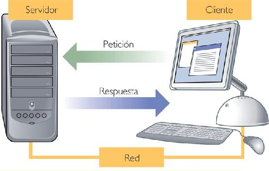
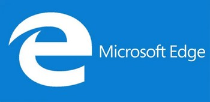
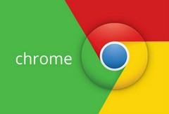
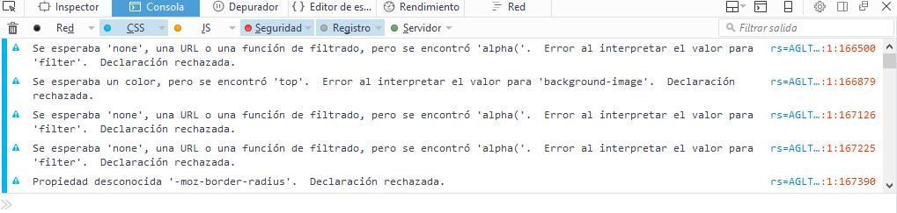
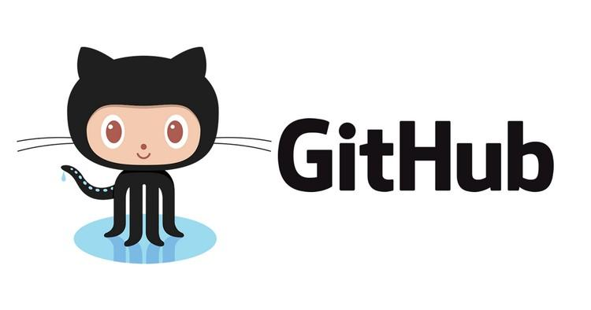

##**<u> 1- DESARROLLO WEB </u>**
La web fue inicialmente concebida y creada por Tim Berners-Lee, un especialista del laboratorio europeo de partículas (CERN) en 1989. En sus mismas palabras, había una "necesidad de una herramienta colaborativa que soportara el conocimiento científico" en un contexto internacional. Él y su compañero Robert Cailliau crearon un prototipo web, lo mostraron a la comunidad para sus pruebas y comentarios.
Dicho prototipo estaba basado en el concepto de hipertexto ( Texto que cuando pulsamos en él nos conduce a otro texto, objeto, sonido, video, sección o documento relacionado ). Como resultado se crearon unos protocolos ( cuando pulsamos en él nos conduce a otro texto, objeto, sonido, vídeo, sección o documento relacionado ) y especificaciones que han
sido adoptados universalmente e incorporados a Internet, gracias a aportaciones posteriores como el desarrollo por la NCSA de la popular interfaz MOSAIC.
Todos los prototipos y desarrollos posteriores crecieron bajo la guía del consorcio W3C, que es una organización con base en el MIT de Massachusetts, que se responsabiliza de desarrollar y mantener los estándares web.

##**<u> 2.- ESTRUCTURA CLIENTE SERVIDOR </u>**

Hoy en día los sitios web siguen un modelo basado en la programación cliente-servidor con tres elementos comunes:

1. **El lado del servidor** [ *server-side* ] Incluye el hardware y software del servidor Web así como diferentes elementos de programación y tecnologías incrustadas. Las tecnologías pueden abarcar un rango amplio desde programas CGI escritos en PERL hasta aplicaciones multihilo ( También denominado multiproceso hace referencia a la posibilidad de ejecutar diferentes trozos de código de una misma aplicación de forma simultánea ) basadas en Java, incluyendo tecnologías de servidor de bases de datos que soporten múltiples sitios web.
2. **El lado del cliente** [ *client-side* ] Este elemento hace referencia a los navegadores web y está soportado por tecnologías como HTML, CSS y lenguajes como JavaScript y controles ActiveX, los cuales se utilizan para crear la presentación de la página o proporcionar características interactivas. Es justamente aquí dónde nos vamos a centrar a lo largo de todo el módulo.
3. **La red** [ *Network* ] Describe los diferentes elementos de conectividad ( Capacidad que tiene un dispositivo para poder conectarse a otros. Aquí se detallan los diferentes protocolos y material utilizado para poder realizar dicha conexión ) utilizados para mostrar el sitio web al usuario.

##**<u> 3.- LENGUAJES DE PROGRAMACIÓN EN CLIENTES WEB </u>**

Cuando hablamos de tecnologías empleadas en lenguajes de programación web podemos citar dos grupos básicos: client-side y server-side. Las tecnologías client-side son aquellas que son ejecutadas en el cliente, generalmente en el contexto del navegador web. Cuando los programas o tecnologías son ejecutadas o interpretadas por el servidor estamos hablando de programación server-side. 
Cada tipo general de programación tiene su propio lugar y la mezcla es generalmente la mejor solución. Cuando hablamos de lenguajes de programación en clientes web, podemos distinguir dos variantes: 

- Lenguajes que nos permiten dar formato y estilo a una página web
    - HTML, CSS, etc.
- Lenguajes que nos permite aportar dinamismo a páginas web
    - Lenguajes de scripting.
    

En este módulo nos vamos a centrar principalmente en estos últimos, los lenguajes de scripting, y en particular en el lenguaje JavaScript que será el lenguaje que utilizaremos a lo largo de todo este módulo formativo.

|               Lado Cliente     *[client-side]*               |              Lado Servidor      *[server-side]*              |
| :----------------------------------------------------------: | :----------------------------------------------------------: |
| Aplicaciones de ayuda Programas del API del navegador  - Plugins del navegador - Applets de java - Controles Activex Lenguajes de Scripting -Javascript -VBScript | Scripts y programas CGI Programas API del servidor - Módulos Apache -Extensiones ISAPI y filtros Lenguajes de Scripting -PHP -.NET  - ColdFusion  |

Hemos escogido JavaScript porque es el lenguaje de script ( Lenguaje de guiones o lenguaje de órdenes que se almacena por lo general en archivos de texto plano y que será ejecutado por un programa intérprete ) más utilizado en la programación en el lado del cliente, y está soportado mayoritariamente por todas las plataformas ( Sistema operativo utilizado por un determinado dispositivo ). Por lo tanto a partir de ahora todas las referencias que hagamos estarán enfocadas hacia JavaScript.

A continuación te mostramos un esquema de las **4 capas del desarrollo web en el lado del cliente**, en la que se puede ver que JavaScript se sitúa en la capa superior gestionando el comportamiento de la página web.

|            Capas del Desarrollo            |
| :----------------------------------------: |
|        Comportamiento (JavaScript)         |
|             Presentación (CSS)             |
|     Estructura (DOM / Estructura HTML)     |
| Contenido (texto , imágenes , vídeos, etc) |

##**<u> 4.- NAVEGADORES </u>**
Para realizar cualquier desarrollo web, es imprescindible comprobar que el resultado que queremos es el adecuado con la mayor cantidad de navegadores posibles, especialmente aquellos más usados. Además de procesar etiquetas HTML, los navegadores suelen interpretar lenguajes de script, siendo Javascript uno de los más populares.

### **Definición de navegador**

Definición: Un navegador o navegador web, o browser (en inglés), es un software que permite el acceso a Internet, interpretando la información de distintos tipos de archivos y sitios web para que estos puedan ser visualizados.
La funcionalidad básica de un navegador web es permitir la visualización de documentos de texto, posiblemente con recursos multimedia incrustados. Además, permite visitar páginas web y hacer actividades en ella, es decir, podemos enlazar un sitio con otro, imprimir, enviar y recibir correo, entre otras funcionalidades más. Los documentos que se muestran en un navegador pueden estar ubicados en la computadora en donde está el usuario, pero también pueden estar en cualquier otro dispositivo que esté conectado en la computadora del usuario o a través de Internet, y que tenga los recursos necesarios para la transmisión de los documentos (un software servidor web).
Tales documentos, comúnmente denominados páginas web, poseen hipervínculos que enlazan una porción de texto o una imagen a otro documento, normalmente relacionado con el texto o la imagen.El seguimiento de enlaces de una página a otra, ubicada en cualquier computadora conectada a Internet, se llama navegación, de donde se origina el nombre navegador.

Para acceder a estos recursos, se utiliza un identificador único llamado URL (Uniform Resource Locator). El **formato general de una URL** es :

**protocolo:**//máquina/directorio/archivo

<u>**Aclaraciones**</u>

- Si no se especifica el directorio, toma como directorio el raíz.
- Si no se especifica el fichero, toma alguno de los nombres por defecto (“index.html”, “index.php”, etc...)

### **Funciones del navegador**

La comunicación entre el servidor web y el navegador se realiza mediante el protocolo HTTP, aunque la mayoría de los navegadores soportan otros protocolos como FTP y HTTPS (una versión cifrada de HTTP basada en Secure Socket Layer o Capa de Conexión Segura (SSL)). La función principal del navegador es obtener documentos HTML e interpretarlos para mostrarlos en pantalla. En la actualidad, no solamente descargan este tipo de  documentos sino que muestran con el documento sus imágenes, sonidos e incluso vídeos streaming en diferentes formatos y protocolos. Además, permiten almacenar la información en el disco o crear marcadores (bookmarks) de las páginas más visitadas. Algunos de los navegadores web más populares se incluyen en lo que se denomina una Suite. Estas Suite disponen de varios programas integrados para leer noticias de Usenet y correo electrónico mediante los protocolos NNTP, IMAP y POP.

Los primeros navegadores web sólo soportaban una versión muy simple de HTML. El rápido desarrollo de los navegadores web propietarios condujo al desarrollo de dialectos no estándares de HTML y a problemas de interoperabilidad en la web. Los más modernos ( como Google Chrome, Mozilla, Netscape, Opera e Internet Explorer/Microsoft Edg e) soportan los estándares HTML y XHTML (comenzando con HTML 4.01, los cuales “deberían” visualizarse de la misma manera en todos ellos).

Los estándares web son un conjunto de recomendaciones dadas por el World Wide Web consortium W3C) y otras organizaciones internacionales acerca de cómo crear e interpretar documentos basados en la web. Su objetivo es crear una web que trabaje mejor para todos, con sitios accesibles a más personas y que funcionen en cualquier dispositivo de acceso a Internet.

Se puede comprobar de manera online si un documento Web cumple el estándar definido por W3C mediante:

**https://validator.w3.org/**

Actualmente la mayoría de navegadores aceptan páginas no estándar, pero cuanto más estándar se la aplicación web desarrollada, mayor probabilidad que funcione correctamente en todos los navegadores. 

**¡¡Importante!!** Es una práctica imprescindible el comprobar que cualquier desarrollo Web funcione correctamente en los principales navegadores.

##**<u> 5.- PRINCIPALES NAVEGADORES </u>**

##### **Microsoft Edge**  -  *Antiguo Internet Explorer* 
  * **URL Oficial** → https://www.microsoft.com/es-es/windows/microsoft-edge
  * *Antiguamente se llamaba Internet Explorer. Microsoft Edge está diseñado para ser un navegador web ligero con un motor de renderizado de código abierto construido en torno a los estándares web.*

##### **Mozilla Firefox**

  * **URL Oficial** → https://www.mozilla.org/es-ES/firefox/new/
  * *Mozilla Firefox es un navegador web libre y de código abierto desarrollado por la Corporación Mozilla y la Fundación Mozilla. Usa el motor Gecko para renderizar páginas webs, el cual implementa actuales y futuros estándares web.*
    * *Posee una versión para desarrolladores: “Firefox Developer Edition” https://www.mozilla.org/en-US/firefox/developer/?utm_source=firebug&utm_medium=lp&utm_campaign=switch&utm_content=landingpage*

##### **Google Chrome**

  * **URL Oficial** → https://www.google.com/chrome/
  * *Google Chrome es un navegador web desarrollado por Google y compilado con base en varios componentes e infraestructuras de desarrollo de aplicaciones (frameworks) de código abierto, como el motor de renderizado Blink (bifurcación o fork de WebKit). Está disponible gratuitamente bajo condiciones específicas del software privativo o cerrado.*

##### **Safari**

  * **URL oficial** → http://www.apple.com/es/safari/
  * *Safari es un navegador web de código cerrado desarrollado por Apple Inc. Está disponible para OS X, iOS (el sistema usado por el iPhone, el iPod touch y iPad) y Windows (sin soporte desde el 2012).*

##### **Opera**

  * **URL oficial** → http://www.opera.com/es

  * *Opera es un navegador web creado por la empresa noruega Opera Software. Usa el motor de renderizado Blink. Tiene versiones para escritorio, teléfonos móviles y tabletas.*

### **¿Que navegador se recomienda para realizar el curso? **

Para realizar las actividades del módulo, recomiendo utilizar **Mozilla Firefox** (aunque es posible usar el que se desee). El motivo de usar este es la gran cantidad de herramientas para depuración que posee incluso en su versión estándar. Para la mayoría de acciones con este será suficiente, pero está disponible una versión que amplia las   herramientas de desarrollo llamada “Firefox Developer Edition”.

##**<u> 6.-HERRAMIENTAS PARA EL DESARROLLO: CONSOLA WEB </u>**
Los navegadores incorporan de manera nativa herramientas para facilitar el desarrollo, entra la que destacamos la “Consola Web”. Asimismo, también mediante ampliaciones (extensiones, plugins, etc.) se amplían características para facilitar el desarrollo y la depuración de código.

Esta consola incluye varias <u>**pestañas**</u>:

* **Red**	 → *Registro de Peticiones HTTP.*

* **CSS**     → *Registra análisis y errores CSS.*

* **JS**         → *Registra análisis y errores Javascript*

* **Seguridad** → *Registra advertencias o fallos de seguridad.*

* **Registro**    → *Registra mensajes enviados al objeto “window.console”*

* **Servidor**    → *Registrar mensajes recibidos del servidor Web.*

El resultado de las peticiones HTTP se muestra de color negro, CSS de color azul, JavaScript amarillo y los errores o advertencias de seguridad de color rojo, registro objeto “window.console” en gris y Servidor en verde.

##**<u> 7.- ENTORNO DE DESARROLLO </u>**

Existen diversos entornos de desarrollo, desde los más sencillos (Brackets, Notepad++, Sublime, Visual Studio Code, etc...) a interfaces más complejas (Aptana, Eclipse, etc...) En principio podéis usar aquel que queráis.

### **Visual Studio Code**

Recomendamos Visual Studio Code. Es software libre y muy potente

 **https://code.visualstudio.com/**

Aquí algunos manuales libres de uso de Visual Studio Code en castellano:

- *http://www.mclibre.org/consultar/informatica/lecciones/vsc-instalacion.html*
- *http://www.mclibre.org/consultar/informatica/lecciones/vsc-personalizacion.html*

### **Control de versiones en Visual Studio Code**
Durante el curso, se utilizarán repositorios Git tanto para la entrega de prácticas como para facilitaros el disponer de un repositorio con control de versiones.
Utilizaremos una cuenta Git en Github :

**https://www-github.com**

Podéis instalarlo en:

* **Ubuntu:**

~~~
	sudo apt-get update
	sudo apt-get install git
~~~

* **Windows:** 
    * *https://git-for-windows.github.io/*

Para facilitar la tarea del uso de Git es recomendable instalar alguna extensión o entorno que os facilite su uso.

* Para usar **Git en Visual Studio Code**
    * *https://code.visualstudio.com/docs/editor/versioncontrol*
    
    * *http://www.mclibre.org/consultar/informatica/lecciones/vsc-git-repositorio.html*
    
      
    
* Aquí un ejemplo del uso de Git en Visual Studio Code.
    * *https://code.visualstudio.com/docs/introvideos/versioncontrol*

##**<u> 8 .- CONTROL DE VERSIONES: GIT – GITHUB </u>**

Git es un software de control de versiones diseñado por Linus Torvalds, pensando en la eficiencia y la confiabilidad del mantenimiento de versiones de aplicaciones cuando éstas tienen un gran número de archivos de código fuente. Su propósito es llevar registro de los cambios en archivos de computadora y coordinar el trabajo que varias personas realizan sobre archivos compartidos Si estás en una distribución basada en Debian como Ubuntu, puedes usar apt-get:
~~~
	apt-get install git
~~~

Para instalar git en otros sistemas operativos puedes utilizar como referencia la información de la web:

https://git-scm.com/book/es/v2/Inicio---Sobre-el-Control-de-Versiones-Instalación-de-Git

### **Órdenes básicas en git*
Crear un subdirectorio nuevo llamado .git, el cual contiene todos los archivos necesarios del repositorio

~~~
git init
~~~

Descargar información de una determinada rama, unifica los comando fetch y merge.

~~~
git pull
~~~

Comienza a trackear el archivo “nombre_archivo”.

~~~
git add <nombre_archivo>
~~~

Confirma los cambios realizados. El “mensaje” generalmente se usa para asociar al commit una breve descripción de los cambios realizados.

~~~
git commit -am "<mensaje>"
~~~

Commitea los cambios desde el branch local origin al branch “nombre_rama”.

~~~
git push origin <nombre_rama>
~~~

Para consultar más comando, puedes visitar la web:

**https://git-scm.com/docs**

### **Github**
GitHub es una forja (plataforma de desarrollo colaborativo) para alojar proyectos utilizando el sistema de control de versiones Git. Se utiliza principalmente para la creación de código fuente de programas de ordenador. El software que opera GitHub fue escrito en Ruby on Rails El 4 de junio de 2018, Microsoft compró GitHub por la cantidad de 7.500 millones de dólares, este cambio de propietarios provocó la salida de varios proyecto desde este repositorio debido la posibilidad de acceso a códigos fuentes por parte de una compañía que su negocios es el software:

**http://www.github.com**

##**<u> 9.- INTEGRACIÓN DE CÓDIGO JAVASCRIPT CON HTML </u>**
Ahora que ya conoces las herramientas que puedes utilizar para comenzar a programar en JavaScript, vamos a ver la forma de integrar el código de JavaScript en tu código HTML.

### **Etiqueta script**
Los navegadores web te permiten varias opciones de inserción de código de JavaScript. Podremos insertar código usando las etiquetas **script** y empleando un atributo **type** indicaremos qué tipo de lenguaje de script estamos utilizando.

~~~~

~~~~

### **Fichero externo**

Otra forma de integrar el código de JavaScript es incrustar un fichero externo que contenga el código de JavaScript. Ésta sería la **forma más recomendable**, ya que así se consigue una separación entre el código y la estructura de la página web y como ventajas adicionales podrás compartir código entre diferentes páginas, centralizar el código para la depuración de errores, tendrás mayor claridad en tus desarrollos, más modularidad, seguridad del código y conseguirás que las páginas carguen más rápido. 
La rapidez de carga de las páginas se consigue al tener el código de JavaScript en un fichero independiente, ya que si más de una página tiene que acceder a ese fichero lo cogerá automáticamente de la caché del navegador con lo que se acelerará la carga de la página.

Para ello tendremos que añadir a la etiqueta **script** el atributo **src** , con el nombre del fichero que contiene el código de JavaScript. Generalmente los ficheros que contienen texto de JavaScript tendrán la *extensión .js* .

~~~~

~~~~

### **En código html**
Otra alternativa consiste en incorporar javascript directamente en elementos html. Numerosos autores no recomiendan esta opción, con el principal motivo de que dificulta considerablemente el mantenimiento de aplicaciones.

~~~~
<body>
	
Párrafo de texto

<body>
~~~~

### **Etiqueta noscript**
El lenguaje HTML define la etiqueta **noscript** para mostrar un mensaje al usuario cuando su navegador no puede ejecutar JavaScript. Esta etiqueta debe incluir en el interior el mensaje a mostrar, además puede incluir cualquier elemento o etiqueta XHTML.
~~~~
<head>
	... 
</head>
<body>
	<noscript>
	
 Bienvenido a Mi Sitio

	
 
		La página que estás viendo requiere para su funcionamiento el uso de JavaScript. 
		Si lo has deshabilitado intencionadamente, por favor vuelve a activarlo
	

	<noscript>
<body>
~~~~
