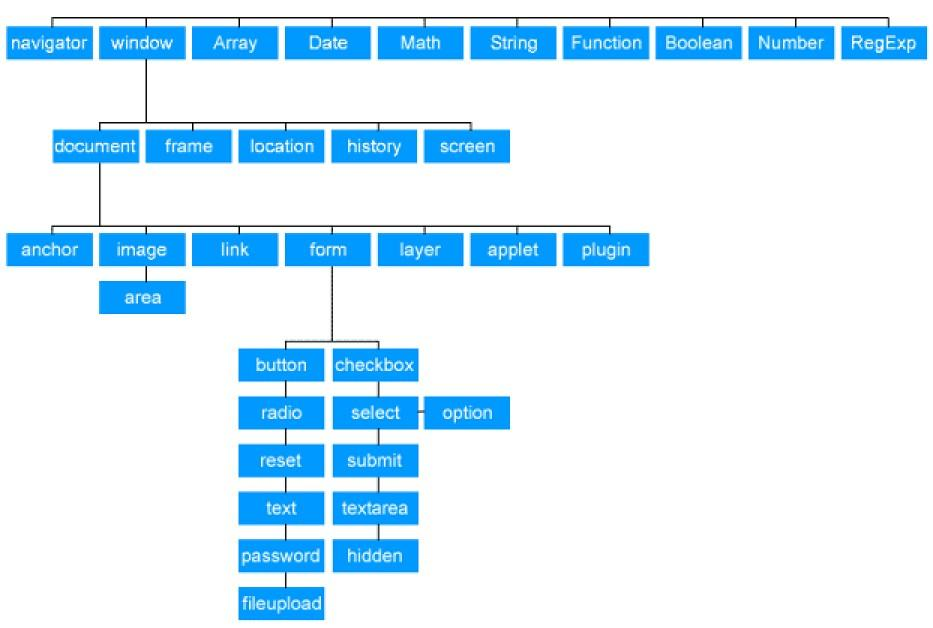
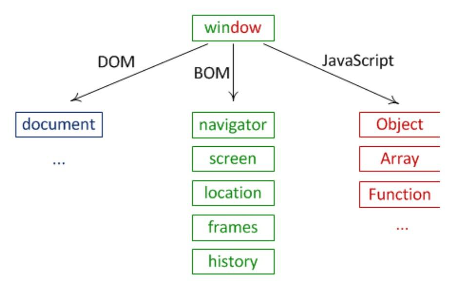

##**<u style="color:#2980B9">1. JERARQUÍA DE OBJETOS NATIVOS DE JAVASCRIPT</u>**
Entre otras posibilidades, Javascript es un lenguaje que de forma nativa posee gran cantidad de funciones y objetos predefinidos. Estas funciones y objetos nos pueden ser útiles para realizar un código mas eficiente, claro y ahorrarnos tiempo re-inventado la rueda.
JavaScript define una jerarquía de objetos que podemos reflejar de forma aproximada en un esquema similar al siguiente:

<center></center>

Para el desarrollo del módulo vamos a considerar las siguientes clasificaciones de objetos:
* Objetos Importantes
    * document , windows
* Objetos del navegador
    * Navigator, Screen, Location, History
* Objetos del lenguaje
    * Object, Boolean, Number, Math, Date, String, Array, RegExp
* Objetos DOM
    * Form, Link, Input, Button, Meta, Image, Area, Style
* Objetos definidos por el usuario.

<center></center>

##**<u style="color:#2980B9">2. OBJETOS IMPORTANTES</u>**
###**<span style="color:#2980B9">Windows</span>**
El objeto Window es un objeto que tiene propiedades y controla elementos de lo que ocurre en la "ventana" del navegador.
Los métodos que estudiamos en el tema anterior como alert, prompt, etc. forman parte del objeto Window.Para hacer llamada a estos métodos no hace falta nombrar explícitamente Window (el navegador ya se encarga de ello).
Algunos de los métodos mas importantes no estudiados previamente son:
* setTimeout(cadenaFuncion,tiempo):
*Este método ejecuta la llamada a la función proporcionada por la cadena (se puede construir una cadena que lleve parámetros) y la ejecuta pasados los milisegundos que hay en la variable tiempo. Devuelve un identificador del "setTimeout" que nos servirá para referenciarlo si deseamos cancelarlo. SetTimeout solo ejecuta la orden una vez.*
* setInterval(cadenaFunción, tiempo):
*Exactamente igual que setTimeout, con la salvedad de que no se ejecuta una vez, sino que se repite cíclicamente cada vez que pasa el tiempo proporcionado.*
* clearTimeout / clearInterval (id):
*Se le pasa el identificador del timeout/interval y lo anula.*
~~~javascript
	// Creamos un intervalo que cada 15 segundos muestra mensaje hola
	let idA=setInterval("alert('hola');",15000);
	// Creamos un timeout que cuando pasen 3 segundos muestra mensaje adios
	let idB=setTimeout("alert('adios');",3000);
	// Creamos un timeout que cuando pasen 5 segundos muestra mensaje
	let idC=setTimeout("alert('esto-no-seve');",5000);
	// Cancelamos el ultimo timeout
	clearTimeout(idC);
~~~
###**<span style="color:#2980B9">2.2 Document</span>**
Cada documento cargado en una ventana del navegador, será un objeto de tipo document. El objeto document proporciona a los scripts, el acceso a todos los elementos HTML dentro de una página. Este objeto forma parte además del objeto window , y puede ser accedido a través de la propiedad window.document o directamente document (ya que podemos omitir la referencia a la window actual).

El objeto document nos permite acceder a las siguientes **<u>colecciones</u>**:

| Colección | Descripción                                                  |
| --------- | ------------------------------------------------------------ |
| anchors[] | Es un array que contiene todos los hiperenlaces del documento. |
| applets[] | Es un array que contiene todos los applets del documento.    |
| forms[]   | Es un array que contiene todos los formularios del documento. |
| images[]  | Es un array que contiene todas las imágenes del documento.   |
| links[]   | Es un array que contiene todos los enlaces del documento.    |

El objeto document nos permite acceder a las siguientes **<u>propiedades y métodos:</u>**

| Propiedad/Método | Descripción                                                  |
| ---------------- | ------------------------------------------------------------ |
| cookie           | Devuelve todos los nombres/valores de las cookies en el documento |
| domain           | Cadena que contiene el nombre de dominio del servidor que cargó el documento. |
| lastModified     | Devuelve la fecha y hora de la última modificación del documento |
| readyState       | Devuelve el estado de carga del documento actual             |
| referrer         | Cadena que contiene la URL del documento desde el cuál llegamos al documento actual |
| title            | Devuelve o ajusta el título del documento.                   |
| URL              | Devuelve la URL completa del documento.                      |
| getElementById() | Para acceder a un elemento identificado por el id escrito entre paréntesis. |
| open()           | Abre el flujo de escritura para poder utilizar document.write() o document.writeln en el documento. |
| close()          | Cierra el flujo abierto previamente con document.open().     |
| write()          | Para poder escribir expresiones HTML o código de JavaScript dentro de un documento. |


##**<u style="color:#2980B9">3. GESTIÓN DE VENTANAS</u>**

JavaScript permite gestionar diferentes aspectos relacionados con las ventanas como por ejemplo, abrir nuevas
ventanas al presionar un botón. Cada una de estas ventanas tiene un tamaño, posición y estilo diferente.
Aclarar que estas ventanas emergentes suelen tener un contenido dinámico.

###**<span style="color:#2980B9">Abrir una Ventana</span>**
Es una operación muy común en las páginas web y en algunas ocasiones se abren sin que el usuario haga nada. HTML permite abrir nuevas ventanas pero no permite ningún control posterior sobre ellas.
Con JavaScript es posible abrir una ventana vacía mediante el método open():
<center>
~~~
nuevaVentana = window.open();
~~~
</center>

El método open(), cuenta con cuatro parámetros y todos son opcionales:
* URL.
* Nombre de la ventana.
* Colección de atributos que definen la apariencia de la ventana.
* True ( URL reemplaza al documento actual ), false ( lo añade )

<center>
~~~
nuevaVentana=window.open("http://www.misitioWeb.com/ads","Publicidad","height=100, width=100");
~~~
</center>

###**<span style="color:#2980B9">Cerrar una Ventana**
Para cerrar una ventana se puede invocar el método close():

<center>
~~~
	myWindow1.document.write('<input type=button value=Cerrar onClick=window.close()>');
~~~
</center>
###**<span style="color:#2980B9">Comunicación entre Ventanas</span>**
Desde una ventana se pueden abrir o cerrar nuevas ventanas. La primera se denomina ventana principal, mientras que las segundas se denominan ventanas secundarias. Desde la ventana principal se puede acceder a las ventanas secundarias.
En el siguiente ejemplo se muestra cómo acceder a una ventana secundaria:

~~~javascript
	<script>
		function abrirVentana(){
			let ventanaSecundaria = window.open("", "VentanaSec","width=500,height=500");
			ventanaSecundaria.document.write(document.getElementByID("idUrl").value);
		}
	</script>
	
	<h1> Comunicación entre ventanas </h1>
	
	<form name="formulario">
		<input id="idUrl" type="text" name="url" size=50 value="http://www.">
		<input type="button" value="Mostrar URL en ventana secundaria" onclik="abrirVentana()">
	</form>
~~~


##**<u style="color:#2980B9">4. ARRAYS</u>**
Son un tipo de objeto y no tienen tamaño fijo sino que podemos añadirle elementos en cualquier momento. Podemos crearlos como instancias del objeto Array:
~~~javascript
	let a=new Array(); // a = []
	let b=new Array(2,4,6); // b = [2, 4, 6]
~~~
Pero lo recomendado es crearlos usando notación JSON (recomendado):
~~~javascript
	let a=[];
	let b=[2,4,6];
~~~
Sus elementos pueden ser de cualquier tipo, incluso podemos tener elementos de tipos distintos en un mismo array. Si no está definido un elemento su valor será undefined. Ej.:
~~~javascript
	let a=['Lunes', 'Martes', 2, 4, 6];
	console.log(a[0]); // imprime 'Lunes'
	console.log(a[4]); // imprime 6
	a[7]='Juan';
	// ahora a=['Lunes', 'Martes', 2, 4, 6, , , 'Juan']
	console.log(a[7]); // imprime 'Juan'
	console.log(a[6]); // imprime undefined
~~~

###**<span style="color:#2980B9">Propiedades de un array</span>**
Length → Esta propiedad devuelve la longitud de un array:
~~~javascript
	let a=['Lunes', 'Martes', 2, 4, 6];
	console.log(a.length); 	// imprime 5
~~~
Podemos reducir el tamaño de un array cambiando esta propiedad:
~~~javascript
	a.length=3;
	// ahora a=['Lunes', 'Martes', 2]
~~~

###**<span style="color:#2980B9">Añadir un elemento</span>**
Añadir/Eliminar Elementos

| Método                      | Descripción                                                  |
| --------------------------- | ------------------------------------------------------------ |
| . **push**( *elemento* )    | Añade uno o varios elementos al final del array.             |
| . **pop**()                 | Elimina y devuelve el último elemento del array.             |
| . **unshift**( *elemento* ) | Añade uno o varios elementos al inicio del array.            |
| . **shift**()               | Elimina y devuelve el primer elemento del array.             |
| . **concat**( *elemento* )  | Concatena los elementos (o elementos de los arrays) pasados por parámetro. |


Podemos añadir elementos al final de un array con push o al principio con unshift:

```javascript
let a=['Lunes', 'Martes', 2, 4, 6];
a.push('Juan'); // a=['Lunes', 'Martes', 2, 4, 6, 'Juan']
a.unshift(7); // a=[7, 'Lunes', 'Martes', 2, 4, 6, 'Juan']
```


Podemos borrar el elemento del final de un array con pop o el del principio con shift. Ambos métodos devuelven el elemento que hemos borrado:

```javascript
let a=['Lunes', 'Martes', 2, 4, 6];
let ultimo=a.pop(); // a=['Lunes', 'Martes', 2, 4] y ultimo=6
let primero=a.shift(); // a=['Martes', 2, 4] y primero='Lunes'4.3 Crear un array derivado
```

###**<span style="color:#2980B9">Crear array derivado</span>**

| Método                            | Descripción                                                  |
| --------------------------------- | ------------------------------------------------------------ |
| . **slice**( *inicio, num_elem* ) | Devuelve los elementos desde la posición "inicio".           |
| . **join**( *separador* )         | Construye una cadena, uniendo los elementos del array mediante el separador |
| . **split**( *separador* )        | Construye un array, a partir de una cadena y un separador.   |

Por ejemplo, Slice, Devuelve un subarray con los elementos indicados pero sin modificar el array original

```javascript
let a=['Lunes', 'Martes', 2, 4, 6];
let subArray=a.slice(1, 3);				// a=['Lunes', 'Martes', 2, 4, 6]
										// subArray=['Martes', 2, 4];
```

Podemos convertir los elementos de un array a una cadena con .join() especificando el carácter separadorde los elementos.

```javascript
let a=['Lunes', 'Martes', 2, 4, 6];
let cadena=a.join('-');					// cadena='Lunes-Martes-2-4-6'
```

###**<span style="color:#2980B9">Búsqueda y comprobación</span>**

| Método                | Descripción                                                  |
| --------------------- | ------------------------------------------------------------ |
| Array.isArray( obj )  | Comprueba si obj es un array. Devuelve true o false.         |
| includes( obj, from ) | Comprueba si obj es uno de los elementos incluidos en el array. |
| .indexOf( obj, from ) | Devuelve la posición de la primera aparición de obj desde from. |


Includes → Devuelve true si el array incluye el elemento pasado como parámetro. Ejemplo:

```javascript
let arrayNotas = [5.2, 3.9, 6, 9.75, 7.5, 3];
arrayNotas.includes(7.5);								// true 
```

###**<span style="color:#2980B9">Ordenación</span>**

| Método      | Descripción                                            |
| ----------- | ------------------------------------------------------ |
| . reverse() | Invierte el orden de elementos del array.              |
| . sort()    | Ordena los elementos del array, ordenación alfabética. |

```javascript
let a=['hola','adios','Bien','Mal',2,5,13,45]
let b=a.sort();			// b=[13, 2, 45, 5 , "Bien", "Mal", "adios", "hola"]
```


###**<span style="color:#2980B9">Array Functions</span>**

Son métodos propios de arrays, que permiten operar sobre todos los elementos del array para alcanzar un objetivo concreto.

* Se les pasa una función de callback que se ejecutará en cada uno de los elementos del array 

| Método               | Descripción                                                  |
| -------------------- | ------------------------------------------------------------ |
| .forEach (cb, arg)   | Realiza la operación definida en cb por cada elemento del array. |
| .every (cb, arg)     | Comprueba si todos los elementos del array cumplen la condición de cb. |
| .some (cb, arg)      | Comprueba si al menos un elemto del array cumple la condición de cb. |
| .map (cb, arg)       | Construye un array con lo que devuelve cb por cada elemento del array. |
| .findIndex (cb, arg) | Devuelve la posición del elemento que cumple la condición de cb. |
| .find (cb, arg)      | Devuelve el elemento que cumple la condición de cb.          |
| . sort( func )       | Ordena los elementos del array bajo un criterio de ordenación func. |

  Resumiendo, las funciones anteriores pueden ser utilizadas para:

```javascript
  let array = ['a', 'bb', 'bc', 'd'];
  array .forEach( function(e,i) {
  	alert('Elemento.' + e + ' en la posición' + i);
  });
  array .every( e => e.length == 1 );					// false
  array .some( e => e.length == 2 );					// true
  let nuevoArr = array .map( e => e.length );			// [1 , 2 , 2 , 1]
  let nuevoArr = array. filter ( e => e[0] == 'b' );	// [‘bb’,’bc’]
  let valor = array. find ( e => e[0] == ‘b’); 			//’bb’
```

##**<u style="color:#2980B9">5. MAP</u>**
Es una colección de parejas de [clave,valor]. Un objeto en Javascript es un tipo particular de Map en que las claves sólo pueden ser texto o números.

| Método                        | Descripción                                                  |
| ----------------------------- | ------------------------------------------------------------ |
| . **set** ( *clave , valor* ) | almacena el valor asociado a la clave.                       |
| . **get** ( *clave* )         | devuelve el valor de la clave. Será "undefined" si la clave no existe en map. |
| . **has** ( *clave* )         | Devuelve truesi la clave existe en map,false si no existe.   |
| . **delete** ( *clave* )      | elimina el valor de la clave.                                |
| . **clear** ()                | elimina todo de map.                                         |
| . **size**                    | tamaño, devuelve la cantidad actual de elementos.            |

```javascript
let persona = new Map();
persona.set('nombre', "Agustin");
persona.set('apellido', "Aguilera");
persona.set('edad', 99);
persona.get("edad"); 		// 99
persona.size 				// 3
persona.delete("edad")
persona.size 				// 2
```

Para recorrer los valores del map utilizando el método foreach:

```javascript
persona.forEach(function(valor,clave,mapa){
	console.log(`valor : ${valor},clave : ${clave},tamaño: ${mapa.size}`);
})
```

Otra alternativa sería utilizar **<u>for.....of</u>**

```javascript
let persona = new Map([
	['nombre', 'Agustin'],
	['apellido', 'Aguilera'],
	['edad', 99]
]);

for (const [clave, valor] of persona.entries()) {
	console.log(clave + ' = ' + valor)
}
```


##**<u style="color:#2980B9">6. SET</u>**
Es como un Map pero que no almacena los valores sino sólo la clave. Podemos verlo como una colección que no permite duplicados. Tiene la propiedad **size** que devuelve su tamaño y los métodos .**add** (añade un elemento), .**delete** (lo elimina) o .**has** (indica si el elemento pasado se encuentra o no en la colección) y también podemos recorrerlo con .**forEach**.

| Método                | Descripción                                                  |
| --------------------- | ------------------------------------------------------------ |
| . **size**            | Tamaño, devuelve la cantidad actual de elementos.            |
| . **set** ( *valor* ) | Almacena el valor en la colección.                           |
| . **has** ( *valor* ) | Devuelve true si el valor existe en el set, false si no existe. |
| . delete ( *valor* )  | Elimina el valor del set                                     |
| . **clear** ()        | Elimina todo los valores de la colección                     |
| ~~. get ( valor )~~   | ¡¡ Función <u>no implementada</u> en **SET** !!              |

Una forma sencilla de eliminar los duplicados de un array es crear con él un Set:

```javascript
let ganadores = ['Márquez', 'Rossi', 'Márquez', 'Lorenzo', 'Rossi', 'Márquez', 'Márquez'];
let ganadoresNoDuplicados = new Set(ganadores); // {'Márquez, 'Rossi', 'Lorenzo'}

// volvemos a convertirlo en un Array.
let ganadoresNoDuplicados = Array.from(new Set(ganadores)); // ['Márquez, 'Rossi', 'Lorenzo']
```


##**<u style="color:#2980B9">7. OBJETO NUMBER</u>**
Number, es utilizado para valores enteros y decimales.

* NaN → **N** ot **a** **N** umber

###**<span style="color:#2980B9">Constantes</span>**
| Constante                    | Descripción           |
| ---------------------------- | --------------------- |
| Number.**POSITIVE_INFINITY** | Infinito positivo: +∞ |
| Number.**NEGATIVE_INFINITY** | Infinito negativo: -∞ |

###**<span style="color:#2980B9">Comprobar números</span>** 


| Propiedad           | Descripción                         |
| ------------------- | ----------------------------------- |
| Number.isFinite(n)  | Comprueba si n es un número finito. |
| Number.isInteger(n) | Comprueba si n es un número entero. |
| Number.isNaN(n)     | Comprueba si n no es un número.     |


###**<span style="color:#2980B9"> Conversión numérica</span>**
| Propiedad                  | Descripción                                           |
| -------------------------- | ----------------------------------------------------- |
| **Number.parseInt**(*s)*   | Convierte una cadena de texto s en un número entero.  |
| **Number.parseFloat**(*s*) | Convierte una cadena de texto s en un número decimal. |


###**<span style="color:#2980B9">Representación numérica</span>**
| Propiedad         | Descripción                                                  |
| ----------------- | ------------------------------------------------------------ |
| .toExponential(n) | Convierte el número a notación exponencial con n decimales.  |
| .toFixed(n)       | Convierte el número a notación de punto fijo con n decimales. |
| .toPrecision(p)   | Utiliza p dígitos de precisión en el número.                 |

```javascript
let n = 4;	// Literal Numérico
let nObj = new Number(4); // Objeto Numérico

//Costantes
    Number.MAX_VALUE
    Number.MIN_VALUE
    Number.NaN 

//MÉTODOS
	Number.isNaN (NaN);		//true, es un not a number
    Number.isNaN (4);    	//false, es un número
   
	Number.isInteger (4);//true, Es un entero
    Number.isInteger (4.7);     //false,Es un decimal

    Number.parseInt ('4');// Pasar a entero la cadena ‘4’
    Number.parseInt ('11101', 2);   // 29, antes se especificó en binario(b=2)
  
	(1234).toString();// "1234", pasa a cadena el valor numérico.
    (1234).toString(2);   // "101101", pasa a binario el valor numérico.
  
   	(1.5).toFixed(3);//1.500 , Punto fijo con 3 decimales
    (1.5).toExponential (2);// "1.50e+0" en exponencial
    (1.5).toFixed (2); // "1.50" en punto fijo
    (1.5).toPrecision (1);    // "2"
       
    typeof n; // number
```


##**<u style="color:#2980B9">8. OBJETO MATH</u>**
###**<span style="color:#2980B9">Constantes**

| Propiedad      | Descripción        |
| -------------- | ------------------ |
| **Math.PI**    | Número PI          |
| **Math.SQRT2** | Raíz cuadrada de 2 |


###**<span style="color:#2980B9">Métodos matemáticos</span>**

| Propiedad            | Descripción                                                  |
| -------------------- | ------------------------------------------------------------ |
| Math.abs(x)          | Devuelve el valor absoluto de x.                             |
| Math.exp(x)          | Exponente, Devuelve el número e elevado a x.                 |
| Math.max(a, b, c...) | Devuelve el número más grande de los indicados por parámetro. |
| Math.min(a, b, c...) | Devuelve el número más pequeño de los indicados por parámetro. |
| Math.sqrt(x)         | Devuelve la raíz cuadrada de x.                              |
| Math.random()        | Devuelve un número al azar entre 0 y 1 (con 16 decimales)    |


###**<span style="color:#2980B9">Métodos de redondeo</span>**
| Propiedad     | Descripción                                         |
| ------------- | --------------------------------------------------- |
| Math.round(x) | Devuelve el redondeo de x . Entero más cercano      |
| Math.ceil(x)  | Devuelve el redondeo superior de x. Entero más alto |
| Math.floor(x) | Devuelve el redondeo inferior de x. Entero más bajo |
| Math.trunc(x) | Devuelve la parte entera                            |


```javascript
//Constantes
	Math.PI 
    Math.abs (-5)	//5,Valor absoluto
    Math.max (1,2,3,4)	//4, Máximo de la lista
    Math.min (1,2,3,4)//1, Mínimo de la lista
    Math.pow (x,y)// x^y
    Math.sqrt (2)// Raíz cuadrada de 2

//Métodos
	Math.floor (4.7)  //4, parte entera, con redondeo inferior
	Math.ceil (4.7)//5, parte entera, con redondeo superior
	Math.round (4.7)//5, parte entera, con redondeo al más cercano
	Math.trunc (4.7)//4, devuelve parte entera(truncamiento)

// Trabajar con aleatorios
	Math.random();	// Número al azar entre [0, 1) con 16 decimales
	let x = Math .floor( Math .random () * 5); // Número entre 0 y 5.

```


##**<u style="color:#2980B9">9. OBJETO STRING</u>**

###**<span style="color:#2980B9"> Propiedades</span>**

| Propiedad | Descripción                                                  |
| --------- | ------------------------------------------------------------ |
| . length  | Devuelve el número de carácteres de la variable de tipo string en cuestión. |

###**<span style="color:#2980B9">Métodos posicionales</span>**

| Propiedad                 | Descripción                                                  |
| ------------------------- | ------------------------------------------------------------ |
| .charAt ( pos )           | Devuelve el carácter en la posición pos de la variable. Similar a [] |
| .concat ( str1, str2... ) | Devuelve el texto de la variable unido a str1, a str2. Similar a + |
| .indexOf ( str )          | Devuelve la primera posición del texto str.                  |
| .indexOf ( str, from )    | Idem al anterior, partiendo desde la posición from.          |

###**<span style="color:#2980B9">Métodos de búsqueda</span>**

| Propiedad           | Descripción                                                  |
| ------------------- | ------------------------------------------------------------ |
| . includes(s, from) | Comprueba si el texto contiene el subtexto s desde la posición from. |
| . search(regex)     | Busca si hay un patrón que encaje con regex y devuelve la posición. |
| . match(regex)      | Idem a la anterior, pero devuelve las coincidencias encontradas. |

###**<span style="color:#2980B9">Métodos de transformar</span>**

| Propiedad                     | Descripción                                                  |
| ----------------------------- | ------------------------------------------------------------ |
| . repeat( n )                 | Devuelve el texto de la variable repetido n veces.           |
| . toLowerCase()               | Devuelve el texto de la variable en minúsculas.              |
| . toUpperCase()               | Devuelve el texto sin espacios a la izquierda y derecha.     |
| . trim()                      | Devuelve el texto sin espacios a la izquierda y derecha.     |
| . replace( regex, newstr )    | Reemplaza la primera aparición del texto str por newstr.     |
| . replaceAll( regex, newstr ) | Reemplaza todas las apariciones del texto str por newstr.    |
| . substr( ini, len )          | Devuelve el subtexto desde la posición ini hasta ini+len.    |
| . split( regex, limit)        | Separa el texto usando sep como separador, en limit fragmentos. |
| . padStart( len, str )        | Rellena el principio de la cadena con str hasta llegar al tamaño len. |
| . padEnd( len, str )          | Rellena el final de la cadena con str hasta llegar al tamaño len. |

###**<span style="color:#2980B9">Concatenación</span>**

| Propiedad     | Descripción                                         |
| ------------- | --------------------------------------------------- |
| +             | Concatenación de cadenas y variables                |
| Backticks ${} | Concatenación de cadenas y variables (en ESMAC2015) |


```javascript
let s = 'cadena'; // Literal Cadena
let sObj = new String (‘cadena’)// Objeto String


// PROPIEDADES
	s.length   // 6, número de carścteres
	“Hola”.lenght // 4, número de carácteres
	s[0] //c,primer caracter

// MÉTODOS
    s.charAt(1)	// c, carácter en la posición 1
    s.indexOf(‘den’) // 3, posición 1a ocurrencia cadena ‘den’, -1 no encontrado
    s.concat(‘33’,’44’) // cadena3344, concatena todas las cadenas
    "Manz".concat("i", "to"); // cadena3344, concatena todas las cadenas 
  
	"Manz". includes ("an"); // true ('Manz' incluye 'an')
	"Hola a todos". search (/o/g);  // busca globalmente las "o", 1, devuelve posición de la 1a o
	"Hola a todos". match (/o/g); // ['o', 'o', 'o'], las 3 "o" que encuentra

    "Na". repeat (5);	// 'NaNaNaNaNa'
    "MANZ". toLowerCase (); // 'manz'
    "manz". toUpperCase ();// 'MANZ'
    " Hola ". trim ();// 'Hola'
    "Amigo". replace ("A", "Ene");// 'Enemigo'
    "Dispara". replace ("a", "i"); // 'Dispira' (sólo reemplaza la primera aparición)
    "Dispara". replace (/a/g, "i"); // 'Dispiri' (reemplaza todas las ocurrencias)
    "Submarino". substr (3); // 'marino' (desde el 3 en adelante)
    "Submarino". substr (3, 1); // 'm' (desde el 3, hasta el 3+1)

	(1:2:3:4). split( ‘:’ ) // Separamos por "," [1,2,3,4]
    "Código".split("");  // ['C', 'ó', 'd', 'i', 'g', 'o'] (6 elementos)

    "5".padStart(6, "0");// '000005'
    "A".padEnd(5, "·"); // 'A····'

    const sujeto = "frase";
    const adjetivo = "concatenada";
    "Una " + sujeto + " bien " + adjetivo;// Concatenación antigua
    `Una ${sujeto} mejor ${adjetivo}` // Concatenación actual

```


##**<u style="color:#2980B9">10. OBJETO DATE</u>**
###**<span style="color:#2980B9">Constructores</span>**

| Propiedad                          | Descripción                                                  |
| ---------------------------------- | ------------------------------------------------------------ |
| new Date()                         | Obtiene la fecha del momento actual.                         |
| new Date( str )                    | Convierte el texto con formato YYYY/MM/DD HH:MM:SS a fecha.  |
| new Date( num )                    | Convierte el número num, en formato Tiempo UNIX, a fecha UTC. |
| new Date( y, m, d, h, min, s, ms ) | Crea una fecha UTC a partir de componentes numéricos*.       |
| Date.now()                         | Devuelve el Tiempo UNIX de la fecha actual. Equivalente a +new Date(). |

###**<span style="color:#2980B9">Getter de fechas</span>**

| Propiedad            | Descripción                                                  |
| -------------------- | ------------------------------------------------------------ |
| .getDay()            | Devuelve el día de la semana: OJO: 0 Domingo, 6 Sábado.      |
| .getFullYear()       | Devuelve el año con 4 cifras.                                |
| .getMonth()          | Devuelve la representación interna del mes. OJO: 0 Enero - 11 Diciembre. |
| .getDate()           | Devuelve el día del mes.                                     |
| .getHours()          | Devuelve la hora. OJO: Formato militar; 23 en lugar de 11.   |
| .getMinutes()        | Devuelve los minutos.                                        |
| .getSeconds()        | Devuelve los segundos.                                       |
| .getMilliseconds()   | Devuelve los milisegundos.                                   |
| .getTime()           | Devuelve el unix timestamp: segundos transcurridos desde 1/1/1970. |
| .getTimezoneOffset() | Diferencia horaria (en min) de la hora local respecto a UTC  |


###**<span style="color:#2980B9">Setter de fechas</span>**

| Propiedad                                         | Descripción                                                  |
| ------------------------------------------------- | ------------------------------------------------------------ |
| .setFullYear( year )<br />.setFullYear( y, m, d ) | Altera el año de la fecha, cambiándolo por year. Formato de 4 dígitos. |
| .setMonth( month )<br />.setMonth( m, d)          | Altera el mes de la fecha, cambiándolo por month. Ojo: 0-11 (Ene-Dic). |
| .setDate( day )                                   | Altera el día de la fecha, cambiándolo por day.              |
| .setHour( hour )<br />.setHour( h, m, s, ms)      | Altera la hora de la fecha, cambiándola por hour.            |
| .setMinutes(min)<br />.setMinutes( m, s, ms )     | Altera los minutos de la fecha, cambiándolos por min.        |
| .setSeconds( sec )<br />.setSeconds( s, ms )      | Altera los segundos de la fecha, cambiándolos por sec.       |
| .setMilliseconds( ms )                            | Altera los milisegundos de la fecha, cambiándolos por ms.    |
| .setTime( ts )                                    | Establece una fecha a partir del tiempo Unix ts.             |


###**<span style="color:#2980B9">Formato de fechas</span>**

| Propiedad             | Descripción                                                  |
| --------------------- | ------------------------------------------------------------ |
| .toDateString()       | Devuelve formato sólo de fecha:  Fri Aug 24 2018             |
| .toLocaleDateString() | Idem al anterior, pero en el formato regional actual:   24/8/2018 |
| .toTimeString()       | Devuelve formato sólo de hora:  00:23:24 GMT+0100 ...        |
| .toLocaleTimeString() | Idem al anterior, pero en el formato regional actual: 0:26:37 |
| .toISOString()        | Devuelve la fecha en el formato ISO 8601: 2018-08-23T23:27:29.380Z |
| .toJSON()             | Idem al anterior, pero asegurándose que será compatible con JSON. |
| .toUTCString()        | Devuelve la fecha, utilizando UTC                            |


```javascript
// INSTANCIAR
    let f = new Date ();// Fecha actual
    let f = new Date ( '2018/01/30 23:30:14' );// Fecha mediante cadena
    let f = new Date ( 872817240000 );// Fecha mediante timestamp
    let f = new Date ( y, m, d, h, min, s, ms ); // Fecha por componentes numéricos
    let f = new Date (2020,11,17);

// GETTER
    const f = new Date ("2018/01/30 15:30:10.999");
    f. getDay ();// 2 (Martes)
    f. getDate (); // 30
    f. getMonth (); // 0 (Enero)
    f. getFullYear ();   // 2025
    f. getHours (); // 15
    f. getMinutes ();  // 30
    f. getSeconds ();  // 10
    f. getMilliseconds ();// 999
    f. getTimezoneOffset (); // 0
    f. getTime (); // 1517326210999 (Tiempo Unix)
      
// SETTER
    const f = new Date("2018/01/30 15:30:10.999");
    f.setDate(15); // Cambia a 15/01/2018 15:30:10.999 (Devuelve 1516030210999)
    f.setMonth(1);   // Cambia a 15/02/2018 15:30:10.999 (Devuelve 1518708610999)
    f.setFullYear(2020);  // Cambia a 15/02/2020 15:30:10.999 (Devuelve 1581780610999)
    f.setHours(21);   // Cambia a 15/02/2020 21:30:10.999 (Devuelve 1581802210999)
    f.setMinutes(00);    // Cambia a 15/02/2020 21:00:10.999 (Devuelve 1581800410999)
    f.setSeconds(3);   // Cambia a 15/02/2020 21:00:03.999 (Devuelve 1581800403999)
    f.setMilliseconds(79);// Cambia a 15/02/2020 21:00:03.079 (Devuelve 1581800403079)
    f.setTime(872817240000);  // Cambia a 29/08/1997 02:14:00.000 (Devuelve 872817240000)
  
   	 // Devolver en formato texto, mes actual
    const MESES = [ "Enero", "Febrero","Marzo","Abril","Mayo","Junio","Julio",   "Agosto","Septiembre","Octubre","Noviembre","Diciembre"];
    const f = new Date ();
    MESES[f. getMonth ()];
    
    f.getTime() // Tiempo en timestamp

// FORMATOS    
    f.toDateString()		// Fri Aug 24 2023
    f.tolocaleDateString()	 // 24/8/2023
    f.tolocaleTimeString() 	// 0/26/37
    
   
    
```


