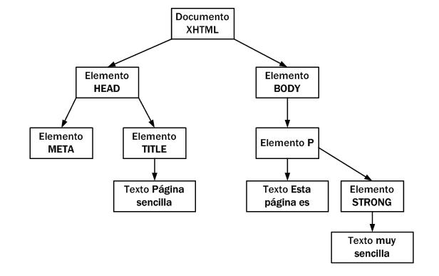

##**<u style="color:#2980B9">1.- MODELO DE OBJETOS DEL DOCUMENTO(DOM)</u>**
La creación del Document Object Model o DOM es una de las innovaciones que más ha influido en el desarrollo de las páginas web dinámicas y de las aplicaciones web más complejas. DOM permite a los programadores web acceder y manipular las páginas XHTML como si fueran documentos XML. De hecho, DOM se diseñó originalmente para manipular de forma sencilla los documentos XML.
A pesar de sus orígenes, DOM se ha convertido en una utilidad disponible para la mayoría de lenguajes de programación (Java, PHP, JavaScript) y cuyas únicas diferencias se encuentran en la forma de implementarlo. Para mas información general de DOM:
* https://es.wikipedia.org/wiki/Document_Object_Model
* http://www.w3schools.com/js/js_htmldom.asp

###**Árbol de nodos**
Una de las tareas habituales en la programación de aplicaciones web con JavaScript consiste en la manipulación de las páginas web. De esta forma, es habitual obtener el valor almacenado por algunos
elementos (por ejemplo los elementos de un formulario), crear un elemento (párrafos, div, etc.) de forma dinámica y añadirlo a la página, aplicar una animación a un elemento (que aparezca/desaparezca, que se desplace, etc.).
Todas estas tareas habituales son muy sencillas de realizar gracias a DOM. Sin embargo, para poder utilizar las utilidades de DOM, es necesario "transformar" la página original. Una página HTML normal no es más que una sucesión de caracteres, por lo que es un formato muy difícil de manipular. Por ello, los navegadores web transforman automáticamente todas las páginas web en una estructura más eficiente de manipular. El siguiente código html, es transformado de forma automática por el navegador, en la siguiente estructura deobjetos DOM con forma de árbol:

###**Tipos de nodos**
La especificación completa de DOM define 12 tipos de nodos, aunque las páginas XHTML habituales se
pueden manipular manejando solamente cuatro o cinco tipos de nodos básicos :
* Document → Nodo raíz del que derivan todos los demás nodos del árbol.
* Element → Representa cada una de las etiquetas XHTML.
* Attr → Representa cada uno de los atributos de las etiquetas XHTML.
* Text → Nodo que contiene el texto encerrado por una etiqueta XHTML.
* Comment → Representa los comentarios incluidos en la página XHTML.

Los otros tipos de nodos existentes que no se van a considerar son :
*  DocumentType , CDataSection , DocumentFragment , Entity , EntityReference , ProcessingInstruction y Notation .

###**Propiedades de un nodo**
Las principales propiedades de un nodo(de tipo element) son:
* elemento.innerHTML: todo lo que hay entre la etiqueta que abre elemento y la que lo cierra, incluyendo otras etiquetas HTML.

~~~
	
Esta página es <strong>muy simple</strong>

	let contenido = elemento.innerHTML;
	// contenido='Esta página es <strong>muy simple</strong>'
~~~

* elemento.textContent: todo lo que hay entre la etiqueta que abre elemento y la que lo cierra, pero ignorando otras etiquetas HTML.
~~~
	let contenido = elemento.textContent;
	// contenido='Esta página es muy simple'
~~~

* elemento.value: devuelve la propiedad 'value' de un input (en el caso de un input de tipo text devuelve lo que hay escrito en él). Como los inputs no tienen etiqueta de cierre no podemos usar .innerHTML ni .textContent

~~~
	<input name="nombre">
	let cont1 = elem1.value;
	// cont1 valdría lo que haya escrito en el <input> en ese momento
	<input type="radio" value="H">Hombre
	let cont2 = elem2.value;
	// cont2="H"2. 
~~~

***
***

##**<u style="color:#2980B9">2 .- ACCESO AL DOCUMENTO DESDE CÓDIGO</u>**
Cuando el árbol de nodos DOM ha sido construido por el navegador de forma automática, podemos acceder a cualquier nodo.En el caso de existir más de un elemento, estos se van almacenando en un array(colección). Las siguientes funciones van a sustituir a la función document.write() que hemos utilizado hasta hoy(no recomiendo seguir utilizándola):

###**Acceso desde propiedades del document**
Supongamos que tenemos una página HTML con la siguiente estructura:

Se consideran como '**<u>atajos</u>**' para obtener algunos elementos comunes:

* *document*.**documentElement** → Devuelve el nodo del elemento  html
* *document*.**head** → Devuelve el nodo del elemento  head
* *document*.**body**→ Devuelve el nodo  del elemento  body
*  *document*.**title** → Devuelve el nodo del elemento  title
* *document*.**link** → Devuelve una colección con todos los hiperenlaces del documento 
* *document*.**anchor** →Devuelve una colección con todas las anclas del documento 
* *document*.**forms** →  Devuelve una colección con todos los formularios del documento 
* *document*.**images**→ Devuelve una colección con todas las imágenes del documento 
* *document*.**scripts**→ Devuelve una colección con todos los scripts del documento

###**Acceso a nodo desde métodos del document**
Las funciones aquí estudiadas normalmente se usan sobre el elemento "document", ya que así se aplican a
todo el documento. Aun así, pueden usarse en cualquier nodo XHTML, entonces la búsqueda se realizaría no
en todo en el documento, sino en al sub-árbol formado por el elemento en si y sus hijos.

**getElementById(*identificador*)**
Esta función devuelve un elemento DOM del sub-árbol cuyo identificador sea el indicado en la cadena "identificador".

~~~javascript
let myDiv = document.getElementById("miDiv");
alert("El html de miDiv es " + myDiv.innerHTML)
~~~

**getElementsByTagName(*etiqueta*)**

Esta función devuelve una array con todos los elementos DOM del sub-árbol cuya etiqueta XHTML sea la indicada en la cadena "etiqueta".

~~~javascript
let myDiv = document.getElementById("miDiv")
let losP = myDiv.getElementsByTagName("p");
let num = losP.length;
alert("Hay " + num + " 
 elementos en el elemento miDiv");
alert("En el primer P el HTML asociado es "+losP[0].innerHTML);
~~~

**getElementsByName(*nombre*)**
Esta función devuelve una array con todos los elementos DOM del sub-árbol cuyo atributo name sea el indicado en la cadena "nombre".

~~~javascript
let x = document.getElementsByName("name");
// Todos los checkbox que tengan de name alumnos, los marcamos
for (let i = 0; i < x.length; i++) {
	if (x[i].type == "checkbox") {
		x[i].checked = true;
	}
}
~~~

**getElementsBy Class Name(*nombre*)**
Esta función devuelve una array con todos los elementos DOM del sub-árbol que tengan la clase indicada en la cadena "nombre".

~~~javascript
let x = document.getElementsByClassName("name");
~~~

A modo de resumen, Las funciones a utilizar son:

| Descripción                 | Función                                   | Resultado |
| --------------------------- | ----------------------------------------- | --------- |
| Directo por Id              | document.getElementById( id )             | 1         |
| Directo por atributo Name   | document.getElementsByName( name )        | [ . . . ] |
| Directo por etiqueta        | document.getElementsByTagName( etiqueta ) | [ . . . ] |
| Directo por nombre de clase | document.getElementsByClassName( name )   | [ . . . ] |

* Directo por Id: 

* Directo por atributo Name:

* Directo por etiqueta:

* Directo por nombre de clase:

  

~~~javascript
<form id= "idForm" name= "nombreForm" class= "miClase" >
    
	document.getElementById("idForm") // id="idForm"
	document.getElementsByName("nombreForm") // name="nombreForm"
	document.getElementsByTagName("form") // etiqueta <form>
	document.getElementsByClassName("miclase") // class="miClase"
~~~

###**Acceso a nodo utilizando selectores CSS**
**.querySelector(*selector*) :**
Devuelve el **primer nodo** seleccionado por el selector CSS indicado.

~~~javascript
let nodo = document.querySelector('p.error');
// la variable nodo contendrá el primer párrafo de clase _error_
~~~

**.querySelectorAll(*selector*) :**
Devuelve **una colección** con todos los nodos seleccionados por el selector CSS indicado.

~~~javascript
let nodos = document.querySelectorAll('p.error');
// la variable nodos contendrá todos los párrafos de clase _error_
~~~

NOTA: al aplicar estos métodos sobre document se seleccionará sobre la página pero podrían también aplicarse a cualquier nodo y en ese caso la búsqueda se realizaría sólo entre los descendientes de dicho nodo.

***
***

##<u>**3.- ACCESO A NODOS A PARTIR DE OTROS</u>**
En muchas ocasiones queremos acceder a cierto nodo a partir de uno dado. Para ello tenemos los siguientes métodos que se aplican sobre un elemento del árbol DOM:

* elemento.**parentElement**
	* *Devuelve el elemento padre de elemento*
* elemento.**children**:
	* *Devuelve la colección con todos los elementos hijo de elemento (sólo elementos HTML, no comentarios ni nodos de tipo texto)*
* elemento.**childNodes**:
	* *Devuelve la colección con todos los hijos de elemento, incluyendo comentarios y nodos de tipo textopor lo que no suele utilizarse*
* elemento.**firstElementChild**:
	* *Devuelve el elemento HTML que es el primer hijo de elemento*
* elemento.**firstChild**:
	* *Devuelve el nodo que es el primer hijo de elemento (incluyendo nodos de tipo texto o comentarios)*
* elemento.**lastElementChild**, elemento.**lastChild**:
	* *Igual pero con el último hijo*
* elemento.**nextElementSibling**:
	* *Devuelve el elemento HTML que es el siguiente hermano de elemento*
* elemento.**nextSibling**:
	* *Devuelve el nodo que es el siguiente hermano de elemento (incluyendo nodos de tipo texto o comentarios)*
* elemento.**previousElementSibling**, elemento.**previousSibling**:
	* *Igual pero con el hermano anterior*
* elemento.**hasChildNodes**:
	* *Indica si elemento tiene o no nodos hijos*
* elemento.**childElementCount**:
	* *Devuelve el no de nodos hijo de elemento*

***
***

##**<u style="color:#2980B9">4.- GESTIÓN DE NODOS</u>**

###**Crear Nodo**
Vamos a ver qué métodos nos permiten cambiar el árbol DOM, y por tanto crear un nodo:

* document.createElement(' etiqueta '): crea un nuevo elemento HTML con la etiqueta indicada, pero aún no se añade a la página.  

  ~~~javascript
  let nuevoLi = document.createElement('li');
  ~~~

* document.createTextNode(' texto '): crea un nuevo nodo de texto con el texto indicado, que luego  tendremos que añadir a un nodo HTML.

  ~~~javascript
    let textoLi = document.createTextNode('Nuevo elemento de lista');
  ~~~

  

* document.createComment(' comentario '): crea un nuevo comentario de código con el texto indicado,  que luego tendremos que añadir a un nodo HTML.

  ~~~javascript
  let comentario = document.createComment('Nuevo comentario de código');
  ~~~

###**Añadir nodo a la página**
  Los siguientes métodos permiten añadir un nodo(creado con las funciones del apartado anterior) a la página:

* elemento.appendChild( nuevoNodo ): añade nuevoNodo como último hijo de elemento. Ahora ya se ha añadido a la página.
  
  ~~~javascript
  // añade el texto creado al elemento LI creado
  nuevoLi.appendChild(textoLi);
  // selecciona el 1o UL de la página
  let miPrimeraLista = document.getElementsByTagName('ul')[0];
  // añade LI como último hijo de UL, es decir al final de la lista
  miPrimeraLista.appendChild(nuevoLi);
  ~~~
  
  
  
* elemento.insertBefore(nuevoNodo, nodo): añade nuevoNodo como hijo de elemento antes del hijo   nodo.
  
  ~~~javascript
  // selecciona el 1o UL de la página
  let miPrimeraLista = document.getElementsByTagName('ul')[0];
  // selecciona el 1o LI de miPrimeraLista
  let primerElementoLista = miPrimeraLista.getElementsByTagName('li')[0];
  // añade LI al principio de la lista
  miPrimeraLista.insertBefore(nuevoLi, primerElementoLista);
  ~~~
  
  
  
###**Eliminar nodo**

  Si el objetivo es eliminar un nodo de la página, debemos utilizar las siguientes funciones:
* elemento.removeChild( nodo ): borra nodo de elemento y por tanto se elimina de la página.
  // selecciona el 1o UL de la página
  let miPrimeraLista = document.getElementsByTagName('ul')[0];
  // selecciona el 1o LI de miPrimeraLista
  let primerElementoLista = miPrimeraLista.getElementsByTagName('li')[0];
  // borra el primer elemento de la lista
  miPrimeraLista.removeChild(primerElementoLista);
  // También podríamos haberlo borrado sin tener el padre con:
  primerElementoDeLista.parentElement.removeChild(primerElementoDeLista);

###** Modificar el DOM con childNode**
  Childnode es una interfaz que permite manipular del DOM de forma más sencilla pero no está soportada en
  los navegadores Safari de IOS. Incluye los métodos:
* elemento.**before**(nuevoNodo) → Añade el nuevoNodo pasado antes del nodo elemento
* elemento.**after**(nuevoNodo) → Añade el nuevoNodo pasado después del nodo elemento
* elemento.**replaceWith**(nuevoNodo) → Reemplaza el nodo elemento con el nuevoNodo pasado
* elemento.**remove**() → Elimina el nodo elemento

***
***

###**<u style="color:#2980B9">5.- GESTIÓN DE ATRIBUTOS</u>**
Podemos ver y modificar los valores de los atributos de cada elemento HTML y también añadir o eliminar atributos:
* elemento.**attributes**:
Devuelve un array con todos los atributos de elemento
* elemento.**hasAttribute**(' nombreAtributo ')
Indica si elemento tiene o no definido el atributo nombreAtributo
* elemento.**getAttribute**(' nombreAtributo '):
Devuelve el valor del atributo nombreAtributo de elemento. Para muchos elementos este valor puede
directamente con elemento.atributo.
* elemento.**setAttribute**(' nombreAtributo ', ' valor '):
Establece valor como nuevo valor del atributo nombreAtributo de elemento. También puede cambiarse el valor directamente con elemento.atributo=valor.
* elemento.**removeAttribute**(' nombreAtributo '):
Elimina el atributo nombreAtributo de elemento

A algunos atributos comunes como id, title o name se puede acceder y cambiar como si fueran una propiedad del elemento (elemento.atributo).

~~~javascript
// selecciona el 1o UL de la página
let miPrimeraLista = document.getElementsByTagName('ul')[0];
miPrimeraLista.id = 'primera-lista';
// es equivalente ha hacer:
miPrimeraLista.setAttribute('id', 'primera-lista');
~~~

~~~javascript

	var enlace = document.getElementById(“idEnlace”);
	div.hasAttribute('data-number'); // true
	div.hasAttributes(); // true (tiene 3)
	div.getAttributeNames(); // ['id','data-number','class']
	div.getAttribute('id'); // 'page'
	div.removeAttribute('id'); // Elimina el atributo id.
	div.setAttribute('id', 'idEnlace'); // Vuelve a añadirlo.
	
	if (enlace.hasAttribute(“href”) == false){
		enlace.setAttribute(“href”, “www.google.es”); // Cambiar href
		enlace.className(“visitado”);// Asignar clase “visitado”
	}
~~~

***
***

##**<u style="color:#2980B9">6.- ATRIBUTOS DE CLASE</u>**

Ya sabemos que el aspecto de la página debe configurarse en el CSS por lo que no debemos aplicar atributos style al HTML. En lugar de ello les ponemos clases a los elementos que harán que se les aplique el estilo definido para dicha clase. 

Como es algo muy común en lugar de utilizar las instrucciones de:

~~~javascript
elemento.setAttribute('className', 'destacado')
elemento.className='destacado'
~~~

Podemos usar la propiedad classList que devuelve la colección de todas las clases que tiene el elemento.

~~~javascript

...:
let clases=elemento.classList; // clases=['destacado', 'direccion'],
~~~

OJO es una colección, no un Array. Además dispone de los **<u>métodos</u>**:

* .**add**(*clase*): añade al elemento la clase pasada (si ya la tiene no hace nada).

~~~
  elemento.classList.add('primero');
  // ahora elemento será 
...
~~~

* .**remove**(*clase*): elimina del elemento la clase pasada (si no la tiene no hace nada).
~~~
  elemento.classList.remove('direccion');
  // ahora elemento será 
...
~~~

* .**toogle**(*clase*): añade la clase pasada si no la tiene o la elimina si la tiene ya.

~~~
  elemento.classList.toogle('destacado');
  // ahora elemento será 
...
  elemento.classList.toogle('direccion');
  // ahora elemento será 
...
~~~

* .**contains**(*clase*): dice si el elemento tiene o no la clase pasada. Ej.:
~~~
  elemento.classList.contains('direccion');
  // devuelve true
~~~

* .**replace**(*oldClase, newClase*): reemplaza del elemento una clase existente por una nueva.

~~~
  elemento.classList.replace('primero', 'ultimo');
  // ahora elemento será 
...
~~~

