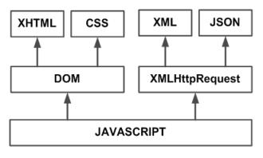
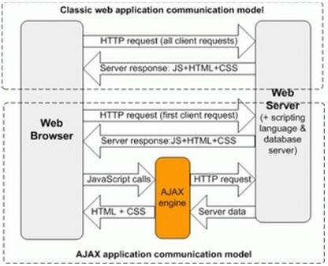
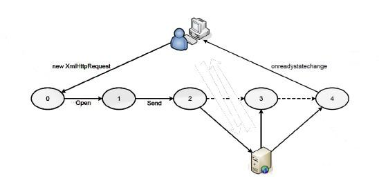
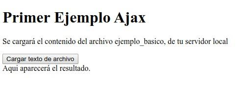
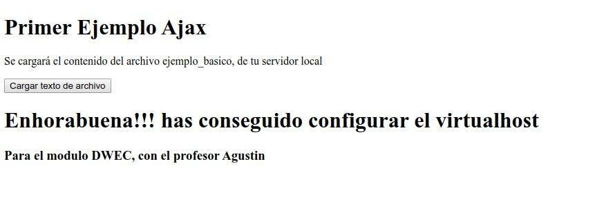

##**<u><span style="color:blue">1.- MECANISMOS DE COMUNICACIÓN ASÍNCRONA</span> </u>**

###**¿Qué es AJAX?**
En primer lugar, aclarar en nuestro contexto informático que no es AJAX:

* Un laureado (aunque ahora en horas bajas) equipo de fútbol holandés.
* Productos de limpieza. 

En nuestro caso, AJAX es el acrónimo de “Asynchronous Javascript And XML” (Javascript asíncrono y XML). AJAX en si no es una tecnología, sino un  conjunto de tecnologías.Tenéis más información en :

https://es.wikipedia.org/wiki/AJAX
https://developer.mozilla.org/es/docs/Web/Guide/AJAX

Las tecnologías presentes en AJAX son:

* XHTML y CSS para la presentación de la página.
* DOM para la manipulación dinámica de elementos de la página.
* Formatos de intercambio de información como JSON o XML.
* El objeto XMLHttpRequest, para el intercambio asíncrono de información (es decir, sin recargar la página).
* Javascript, para aplicar las anteriores tecnologías.

<center></center>

La forma de trabajar es la siguiente: Javascript se encarga de unir todas las tecnologías. Para manipular la parte de representación de la página utiliza DOM (así manipula el XHTML y el CSS). Para realizar peticiones asíncronas usa el objeto XMLHttpRequest. Este objeto intercambia información que son simplemente cadenas de texto. Cuando se quieren formatear objetos más complejos, se suele utilizar JSON o XML.


###** Funcionamiento de aplicación Web clásica VS aplicación Web AJAX**

En una aplicación Web clásica:

1. El cliente hace una petición al servidor.

2. El servidor recibe la petición.

3. El servidor procesa la petición y genera una nueva página con la petición procesada.

4. El cliente recibe la nueva página completa y la muestra.
    Aplicación Web AJAX

    

En una aplicación Web AJAX:

1. El cliente hace una petición asíncrona al servidor.

2. El servidor recibe la petición.

3. El servidor procesa la petición y responde asíncronamente al cliente.

4. El cliente recibe la respuesta y con ella modifica dinámicamente los elementos afectados de la   página sin recargarla completamente.


   Ventaja Las aplicaciones Web AJAX son mejores ya que reducen la cantidad de información a intercambiar (no se envía la página entera, sino que se modifica solo lo que interesa) y a su vez al usuario final le da una imagen de mayor dinamismo, viendo una página web como una aplicación de escritorio.

   Desventajas Como único contra, el diseño de aplicaciones Web AJAX es ligeramente más complicado que el desarrollo de aplicaciones Web clásicas.

   Desventajas Visitando el agregador de noticias https://www.meneame.net/ y “meneando” cualquier noticia, podéis ver como funciona AJAX (el contador de “meneos” aumenta, pero la página no se ha  recargado).

<center></center>


##**<u><span style="color:blue">2.CONFIGURACIÓN DEL SERVIDOR</span> </u>**

Para probar los ejemplos, necesitaréis un servidor al que hacer peticiones asíncronas.

###** Configurar Apache**


Para montar un servidor en local para pruebas, estos video tutoriales pueden seros útiles:

* Instalar LAMP en Ubuntu :
  https://www.youtube.com/watch?v=f-l07vKQLW0
* Instalar WAMP en Windows :
  https://www.youtube.com/watch?v=aUa2-0l2ZXc


###**Configurar virtualhost**

Para el sistema operativo ubuntu(Debian), a modo resumen, necesitarás los siguientes comandos:

```javascript
sudo apt-get update
sudo apt-get install apache2
sudo apt-get install mysql-server mysql-client
sudo apt-get install php libapache2-mod-php php-mysql
sudo mkdir -p /var/www/html/dwec/public_html
sudo chown -R $USER:$USER /var/www/html/dwec/public_html
sudo chmod -R 777 /var/www/html/dwec
gedit /var/www/html/dwec/public_html/index.html
```


El archivo index.html, debe tener el siguiente contenido:

```javascript

<html>
	<head>
		<title> Bienvenido a DWEC</title>
	</head>
	
	<body>
		<h1> Enhorabuena!!! Has conseguido configurar el virtualhost </h1>
		<h3> Para el módulo DWEC, con el profesor Agustín</h3>
	
	</body>

</html>

```


```javascript
cat /etc/apache2/sites-available/000-default.conf
sudo cp /etc/apache2/sites-available/000-default.conf /etc/apache2/sites-available/dwec.conf
sudo gedit /etc/apache2/sites-available/dwec.conf
```

 El archivo de virtualhost debe tener el siguiente contenido:

 ```javascript
	 <VirtualHost *:80>
	 	ServerAdmin admin@example.com
	 	ServerName www.dwec.agustin.com
	 	ServerAlias www.dwec.agustin.com
	 	DocumentRoot /var/www/html/dwec/public_html
	 	ErrorLog ${APACHE_LOG_DIR}/error.log
		CustomLog ${APACHE_LOG_DIR}/access.log combined
		
		Header set Access-Control-Allow-Origin "*"
		Header set Access-Control-Allow-Methods "POSTS, GET, OPTIONS, DELETE, PUT"
		Header set Access-Control-Allow-Headers "Origin, X-Requested-With, Content-Type, Accept"
	 </VirtualHost> 
		
 ```

```javascript
	sudo a2ensite dwec.conf
 	systemctl reload apache2
 	systemctl status apache2
 	sudo gedit /etc/hosts
```

El contenido del archivo host, debe contener el dns asociado al módulo:

```javascript
	127.0.0.1	localhost
	127.0.1.1	agustin-pc
	127.0.0.1	www.dwec.agustin.com
```

Si has realizado correctamente todos los paso anteriores, debe conseguir el siguiente resultado en el navegador:

<center></center>

##**<u><span style="color:blue">3.OBJETO XMLHTTPREQUEST</span> </u>**

En esta unidad didáctica hablaremos de como funciona el objeto XMLHttpRequest, imprescindible para utilizar AJAX. Este objeto nos permitirá hacer peticiones asíncronas y se encargará de avisarnos cuando se reciba su respuesta.

En https://es.wikipedia.org/wiki/XMLHttpRequest se puede observar una definición del objeto y sus principales atributos y métodos.


###**Atributos**

| Atributo     | Descripción                                                  |
| ------------ | ------------------------------------------------------------ |
| readyState   | Devuelve el estado del objeto como sigue: <br /> 0 = sin inicializar, 1 = abierto, 2 = cabeceras recibidas, 3 = cargando y 4 = completado. |
| responseBody | (Level 2) Devuelve la respuesta como un array de bytes       |
| responseText | Devuelve la respuesta como una cadena                        |
| responseXML  | Devuelve la respuesta como XML. Esta propiedad devuelve un objeto documento XML, que puede ser examinado usando las propiedades y métodos del árbol del DOM |
| status       | Devuelve el estado como un número (p. ej. 404 para "Not Found" y 200 para "OK"). |
| statusText   | Devuelve el estado como una cadena (p. ej. "Not Found" o "OK"). |

###**Métodos**

|                            Método                            | Descripción                                                  |
| :----------------------------------------------------------: | ------------------------------------------------------------ |
|                           abort()                            | Cancela la petición en curso                                 |
|                   getAllResponseHeaders()                    | Devuelve el conjunto de cabeceras HTTP como una cadena.      |
|           GetResponseHeader<br/>( nombreCabecera )           | Devuelve el valor de la cabecera HTTP especificada.          |
| open<br/>( método,<br /> URL, <br />[asíncrono<br/>[nombreUsuario [clave]]] ) | Especifica el método, URL y otros atributos opcionales de unapetición.<br/>El parámetro de método puede tomar los valores: "GET", "POST", o "PUT".<br/>El parámetro URL puede ser una URL relativa o completa.<br/><br />El parámetro asíncrono especifica si la petición será gestionada síncronamente o no. Un valor true indica que el proceso del script continúa después del método send(), sin esperar a la respuesta, y false indica que el script se detiene hasta que se complete laoperación, tras lo cual se reanuda la ejecución.<br/><br />En el caso asíncrono se especifican manejadores de eventos, que se ejecutan ante cada cambio de estado y permiten tratar los resultados de la consulta una vez que se reciben, o bien gestionar eventuales errores. |
|                       send( [datos] )                        | Envía la petición                                            |
|           SetRequestHeader<br/>( etiqueta, valor )           | Añade un par etiqueta/valor a la cabecera HTTP a enviar.     |


###**Eventos**

|     Propiedad      |                         Descripción                          |
| :----------------: | :----------------------------------------------------------: |
| onreadystatechange |       Evento que se dispara con cada cambio de estado.       |
|      onabort       |   (Level 2) Evento que se dispara al abortar la operación.   |
|       onload       |    (Level 2)Evento que se dispara al completar la carga.     |
|    onloadstart     |     (Level 2) Evento que se dispara al iniciar la carga.     |
|     onprogress     | (Level 2) Evento que se dispara periódicamente con información de estado. |

 

##**<u><span style="color:blue">4.FORMA MÁS COMÚN DE UTILIZAR XMLHTTPREQUEST</span> </u>**

###**Instanciando el objeto**

En primer lugar, indicar que debemos inicializar el objeto.

```javascript
httpRequest = new XMLHttpRequest();
```

Esto es válido para la mayoría de navegadores actuales. Si queremos compatibilidad con navegadores antiguos que soporte ActiveX (Tipo Internet Explorer 6) se puede hacer una función más compleja para obtener el objeto.

```javascript
function obtainXMLHttpRequest()
{
	var httpRequest;
	if (window.XMLHttpRequest){
         /// código para IE7+, Firefox, Chrome, Opera, Safari
		httpRequest = new XMLHttpRequest();
	}
	else if (window.ActiveXObject){
		try {
			httpRequest = new ActiveXObject("MSXML2.XMLHTTP");
		} catch (e) {
			try {
				// código para IE6, IE5
				httpRequest = new ActiveXObject("Microsoft.XMLHTTP");
			} catch (e) {}
		}
	}
  
    // Si no se puede crear, devolvemos false.
    // En caso contrario, devolvemos el objeto
	return (!httpRequest)? false : httpRequest;

}
```

###**Comportamiento evento**

Tras ello, decidiremos el comportamiento del evento “onreadystatechange”, evento que se producirá cada vez que haya producido un cambio en el atributo “ready”.

Antes de hacer nada, deberemos explicar 3 métodos del objeto:

* open(Metodo,URL,true). Este método recibe que método de comunicación utiliza en la petición (GET o POST) y que ULR se aplica. 
* send([datos]). Ha de hacerse posteriormente a un open, nunca antes. Envía la información a la URL especificada en open. 
* SetRequestHeader Indicara el formato de las cabeceras enviadas.

También debemos explicar el atributo readyState. Contiene un valor numérico entero que representa la situación del intercambio de datos a través del objeto.

| Código |                    Descripción                    |
| ------ | :-----------------------------------------------: |
| 0      |            Al inicializarse el objeto.            |
| 1      | Al abrirse una conexión (al usar el método open). |
| 2      |       Al hacer una petición (uso de send).        |
| 3      |       Al hacer una petición (uso de send).        |
| 4      |       cuando la petición se ha completado.        |

Esta imagen resume el proceso:

center></center>

También debemos explicar el atributo status. Código numérico entero enviado por el servidor que indica el tipo de respuesta dada a la petición. Puede tomar valores como:

| Código | Descripción                |
| ------ | -------------------------- |
| 200    | Respuesta correcta         |
| 404    | No encontrado              |
| 500    | Error interno del servidor |

y por último los eventos asociados al objeto xmlhttpRequest

| Evento    | Descripción                                                  |
| --------- | ------------------------------------------------------------ |
| loadstart | Cuando la solicitud comienza.                                |
| progress  | Lanzado cada 50ms mientras se envían datos.                  |
| abort     | La petición ha sido abortada                                 |
| error     | Lanzado si se produce un error procesando la solicitud.      |
| load      | Disparado cuando la solicitud ha sido completada con éxito.  |
| timeout   | Se puede especificar un timeout, y cuando se llega a este se dispara este evento. |
| loadend   | Disparado cuando la solicitud ha sido completada con o sin éxito |

###**Implementando el evento load**

```javascript
let peticionhttp=new XMLHttpRequest();
let boton = document.getElementById("idBoton");
boton.addEventListener('click',cargarAJAX,false);

function cargarAJAX() {
	peticionhttp.addEventListener('load',cargar,false);
 	peticionhttp.open("GET", "http://www.dwec.agustin.com/index.html", true);
 	peticionhttp.send(null);
};

function cargar() {
	var r = document.getElementById("idResultado");
 	if (peticionhttp.readyState == 4 && peticionhttp.status == 200) {
 		r.innerHTML = peticionhttp.responseText
 	} else {
 		r.innerHTML = "En proceso";
 	}
 }

```

En este ejemplo, abrimos con open, definimos el comportamiento del evento “load” y cuando esta todo listo, enviamos la petición con send.Teniendo el archivo html original:

<center></center>

Después de realizar la consulta el resultado será el siguiente:
<center></center>

##**<u><span style="color:blue">5.WEB STORAGE</span> </u>**

El texto localStorage es una tecnología de almacenamiento existente en los navegadores más modernos, siendo incompatible con navegadores antiguos. La información se almacena en el cliente y generalmente posee al menos 5MB para guardar información:

http://www.w3schools.com/html/html5_webstorage.asp

A efectos prácticos debéis conocer que hay dos objetos: localStorage y sessionStorage. La diferencia entre uno y otro es que localStorage almacena la información indefinidamente y sessionStorage lo hace solo mientras la ventana de la página este abierta. Por el resto de detalles ambos objetos funcionan igual y en los ejemplos nos referiremos únicamente a localStorage.

La funciones a utilizar son 3:

* **setItem** → Asigna un item
* **getItem** → Obtiene el valor de un item
* **removeItem** → Borra un item determinado

```javascript
if (typeof(Storage) !== "undefined") {
 	// Código relacionado con localStorage/sessionStorage.
	localStorage.setItem("apellido", "Garcia");
	alert(localStorage.getItem("apellido"));
	
    localStorage.removeItem("apellido");
	alert(localStorage.getItem("apellido"));
} else {
 // Sorry! No Web Storage support..
}
```

Una manera de almacenar objetos es utilizando JSON. Como la representación de los objetos en JSON puede realizarse a través de texto, podemos almacenar estas cadenas de texto 

```javascript
var videoDetails = {
	title : 'Matrix',
 	author : ['Andy Wachowski', 'Larry Wachowski'],
 	description : 'Wake up Neo, the Matrix has you...',
 	rating: '-2'
};
```

y recuperarlas posteriormente para convertirlas en objetos.

```javascript
sessionStorage.setItem('videoDetails', JSON.stringify(videoDetails) );
var videoDetails = JSON.parse(sessionStorage.getItem('videoDetails');
```


##**<u><span style="color:blue">6.COOKIES</span> </u>**

Las cookies son datos, almacenados en pequeños archivos de texto, en su computadora. Cuando un servidor web ha enviado una página web a un navegador, la conexión se cierra y el servidor se olvida de todo sobre el usuario.

Las cookies se inventaron para resolver el problema "cómo recordar información sobre el usuario":

* Cuando un usuario visita una página web, su nombre puede almacenarse en una cookie.
* La próxima vez que el usuario visite la página, la cookie "recordará" su nombre.

Para crear una cookie, usamos document.cookie. Esto es una string especial que tiene el siguiente formato:

```
“variable=valor;expires=fecha expiración;path=/”
```

Donde variable es la variable a establecer, valor su valor, expires es la fecha de expiración (la forma de borrar cookies es cambiarles la fecha de expiración a una ya pasada) y path el lugar del dominio donde son válidas 


```javascript
document.cookie = "username=John Smith; expires=Thu, 18 Dec 2013 12:00:00 UTC; path=/";
```


A efectos prácticos, recomiendo el uso de estas funciones ya establecidas para crear, consultar y eliminar cookies:


| Función      | Descripción                     |
| ------------ | ------------------------------- |
| setCookie    | Almacenar un valor en la cookie |
| getCookie    | Obtener un valor en la cookie   |
| deleteCookie | Eliminar un valor en la cookie  |


Para conocer el código interno de estas funciones, debes visistar la siguiente página:


https://www.w3schools.com/js/js_cookies.asp
